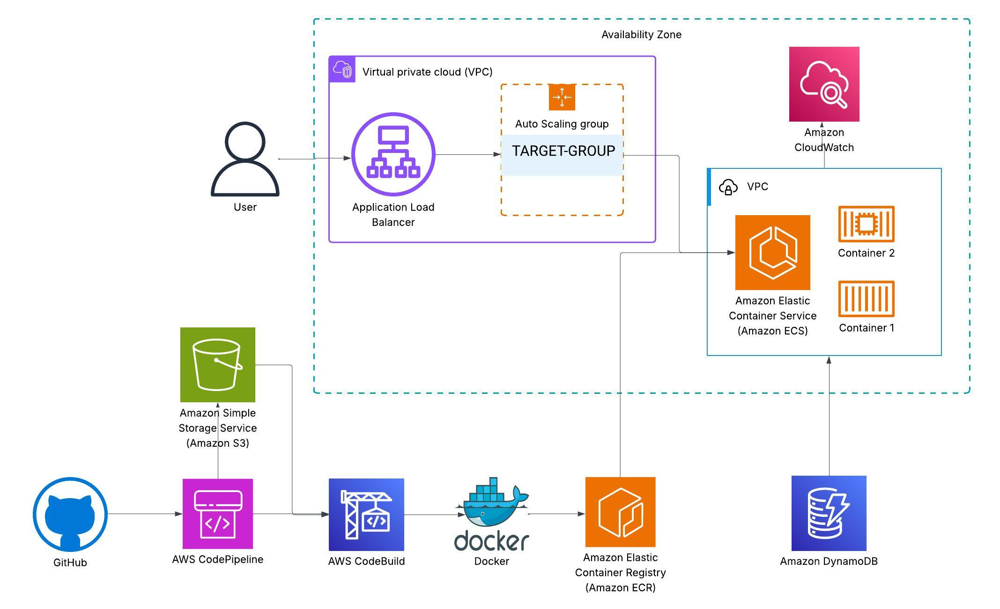

# 🛍️ GoInventoryAPI – AWS GoLang REST API

A scalable, cloud-native REST API built in **GoLang**, deployed using **Docker + ECS (Fargate)**, and delivered through a full **CI/CD pipeline on AWS**. The API supports **product listing**, **filtering**, **localization**, and **membership-based pricing**.

---

## 📸 Architecture Diagram



---

## 🚀 Live Demo

> **[GET All Products](http://productsapi-alb-1117553191.us-east-1.elb.amazonaws.com/api/products)**
> `http://productsapi-alb-1117553191.us-east-1.elb.amazonaws.com/api/products`

### ✅ Headers Supported:

```http
Accept-Language: en-gb | de-de
X-Member: true | false
```

### 🔎 Query Parameters:

* `limit` → limits number of products (e.g., `?limit=3`)
* `minPrice` → filter products with price ≥ x
* `maxPrice` → filter products with price ≤ x
* `inStock` → true / false
* `colour` → partial match (e.g., `red`, `black`)

### 🧪 Example Request:

```bash
curl -H "Accept-Language: en-gb" \
     -H "X-Member: true" \
     "http://productsapi-alb-1117553191.us-east-1.elb.amazonaws.com/api/products?limit=2&colour=black"
```

---

## 🐳 Docker Build & Run (Temporary IAM Credentials)

This project is designed to be run using Docker for consistency. Follow the steps below to build and launch the app with AWS access:

### ✅ Step 1 – Build the Docker image & Run the Docker container with IAM credentials:
Check runner.txt in root when you extract the zip

Once running, visit: `http://localhost:8080/api/products`

---

## ✨ Features Implemented

* ✅ `GET /api/products` — returns a list of products with optional filters
* ✅ `GET /api/products/:id` — returns a single product by ID
* ✅ **Locale-based translations** for `description`, `features`, and `shortDescription`
* ✅ **Membership pricing** support (shows discounted price if `X-Member: true`)
* ✅ **Filtering** support for:

  * `minPrice` / `maxPrice`
  * `inStock`
  * `colour` (partial match like "red" in "Red/Black")
* ✅ **Pagination** via `limit` query param
* ✅ Fully **Dockerized** for local and production builds
* ✅ Hosted on **ECS Fargate** and exposed via **Application Load Balancer (ALB)**
* ✅ **CI/CD** using **CodePipeline** and **CodeBuild**
* ✅ Logs via **CloudWatch**, IAM roles scoped securely
* ✅ Includes **unit and integration tests** for robustness

---

## 📦 Backend Details

Built with the Gin web framework and AWS SDK v2, the application provides fast and flexible REST endpoints designed to power product listings and detail views.

### Endpoints:

* **GET /api/products**: List all products with optional filters and pagination.
* **GET /api/products/\:productID**: Retrieve detailed information about a single product.
* **GET /api/query-db**: Raw DynamoDB scan (primarily for debug/dev).

---

## 📁 Project Structure

```
Go_InventoryAPI/
├── cmd/                   # Entry point
├── internal/
│   ├── handlers/         # API route logic
│   │   ├── product.go
│   │   ├── filters.go
│   │   ├── locale.go
│   │   └── pricing.go
│   ├── models/           # Product model schemas
│   │   └── product.go
│   └── utils/            # DynamoDB logic, filtering, translation
│       ├── loader.go
│       └── loader_mock.go
├── test/                 # Unit + integration tests
│   ├── unitTests/
│   └── product_test.go
├── Dockerfile            # Multi-stage build and test
├── buildspec.yml         # AWS CodeBuild instructions
├── terraform/            # Infrastructure as code (optional)
├── .env.example          # Environment variables reference
├── .gitignore
└── README.md             # You are here
```

---

## 🧪 Running Tests

To run all tests:

```bash
go test ./... -v
```

Unit tests include filters and translation logic. Integration tests hit actual endpoints and validate full flow.

---

## 🧱 AWS Services Used

* **ALB** in two public subnets (multi-AZ)
* **ECS Fargate** service with Go app container
* **DynamoDB** for high-throughput NoSQL storage
* **CodePipeline + CodeBuild** for CI/CD
* **CloudWatch** for centralized logging
* **IAM roles** restrict access to only needed services

### 📡 Request Flow

```
User → ALB → ECS (Go App) → DynamoDB → Response
GitHub → CodePipeline → CodeBuild → ECS Update
```

---

## 📝 Submission Highlights

* ✅ Hosted API is live and tested
* ✅ CI/CD enabled via GitHub push → CodePipeline → ECS
* ✅ Tested: both unit & integration levels
* ✅ Dockerized for consistency
* ✅ Clean project structure, clear docs
* ✅ Production-ready AWS-native architecture

---

## 👨‍💻 Authors & Contributions

Made with ❤️ by your development team. Maintainers:

https://www.linkedin.com/in/sumitakoliya/

https://sumitakoliya.com

https://github.com/sammygojs

---

## 📄 License

MIT License

---

Enjoy exploring ProductsAPI! 🚀
